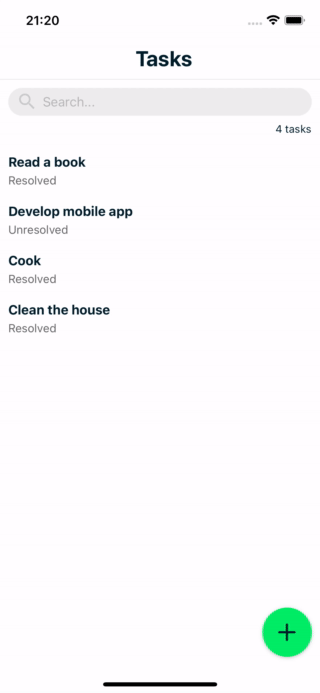

# To-do List Offline First

A offline first mobile application to create to-do list 📱



## Technologies used

[](https://reactjs.org/) [](https://reactnative.dev/) [](https://www.typescriptlang.org/) [](https://www.mongodb.com/docs/realm/sdk/react-native/) [](https://www.mongodb.com/docs/realm/sdk/react-native/) [](https://react-hook-form.com/) [](https://docs.expo.dev/) [](https://github.com/jquense/yup) [](https://github.com/pmndrs/zustand) [](https://docs.swmansion.com/react-native-reanimated/) [](https://docs.swmansion.com/react-native-gesture-handler/docs/) [](https://axios-http.com/ptbr/docs/intro) [](https://github.com/typicode/json-server)

## Run application

1 - Fork this repository

2 - Install dependencies:

```shell
npm install
```

or

```shell
yarn
```

3 - Create a `db.json` file in the application root with the contents below:

```json
{
  "tasks": []
}
```

4 - Run server:

```shell
npm run jsonserver
```

or

```shell
yarn jsonserver
```

5 - Run application:

**iOS**

```shell
npm run ios
```

or

```shell
yarn ios
```

**Android**

```shell
npm run android
```

or

```shell
yarn android
```

---

Developed with ❤️ by [andrecoelho.dev](https://andrecoelho.dev)
